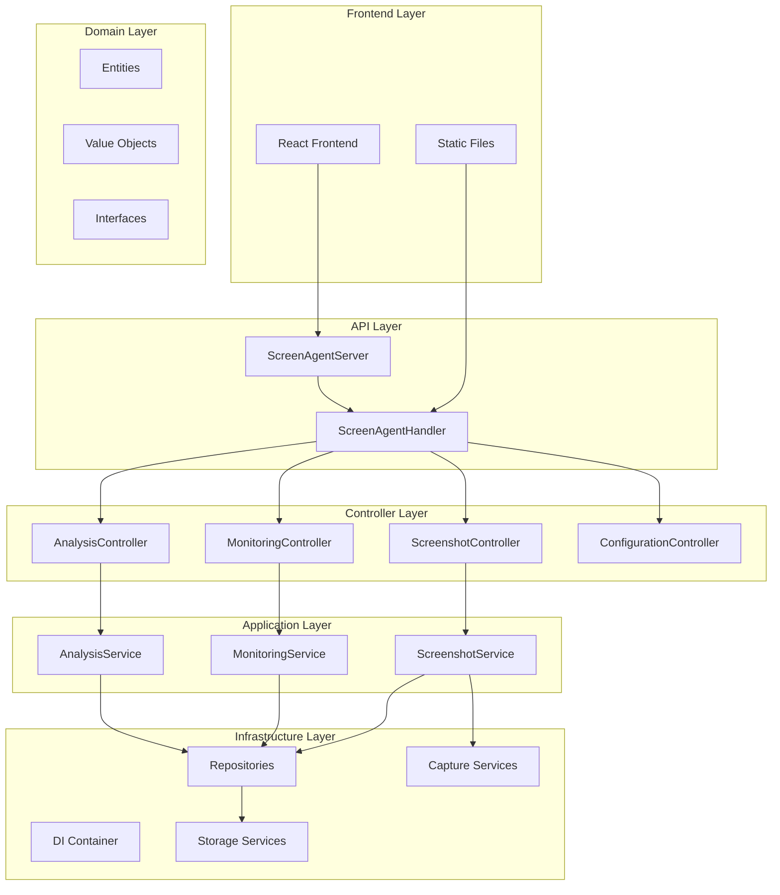
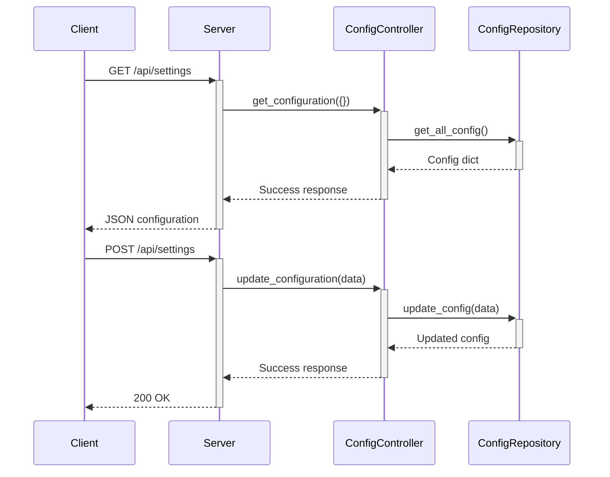

# ScreenAgent Backend - Design Analysis & Architecture Review

**Date**: June 23, 2025  
**Analysis Purpose**: Comprehensive backend codebase review for refactoring

## Executive Summary

The ScreenAgent backend is a Python-based web application implementing clean architecture principles with dependency injection. However, it suffers from several architectural issues including a monolithic HTTP server, missing HTTP method support, and inconsistent API patterns.

**Key Issues Identified:**
1. **Missing HTTP HEAD Method Support** - Causing 501 errors for HEAD requests (`curl -I` fails)
2. **Monolithic HTTP Server** - 577-line server class violating SRP
3. **Manual URL Routing** - Error-prone if-elif chains instead of proper routing
4. **Mixed Concerns** - HTTP handling mixed with business logic
5. **Incomplete API Implementation** - Several endpoints return 404/500 errors

## Architecture Overview



## API Endpoint Analysis

### Current API Endpoints

| Method | Endpoint | Status | Controller | Issues |
|--------|----------|--------|------------|--------|
| GET | `/api/screenshots` | ✅ Working | ScreenshotController | None |
| GET | `/api/status` | ✅ Working | MonitoringController | None |
| GET | `/api/settings` | ✅ Working | ConfigurationController | None |
| GET | `/api/roi` | ✅ Working | ConfigurationController | None |
| GET | `/api/preview` | ⚠️ Incomplete | ScreenshotController | Returns binary data inconsistently |
| POST | `/api/trigger` | ✅ Working | ScreenshotController | None |
| POST | `/api/analyze` | ✅ Working | AnalysisController | None |
| POST | `/api/settings` | ✅ Working | ConfigurationController | None |
| POST | `/api/monitor/settings` | ✅ Working | MonitoringController | Legacy endpoint |
| POST | `/api/monitoring/start` | ✅ Working | MonitoringController | None |
| POST | `/api/monitoring/stop` | ✅ Working | MonitoringController | None |
| DELETE | `/api/screenshots` | ✅ Working | ScreenshotController | None |
| HEAD | `/*` | ❌ **NOT IMPLEMENTED** | None | **501 Error** |

## API Flow Sequence Diagrams

### 1. Screenshot Capture Flow


### 2. Preview Screenshot Flow (Current Issue)

```mermaid
sequenceDiagram
    participant Client
    participant Server
    participant ScreenshotController
    participant ScreenshotService

    Client->>+Server: GET /api/preview
    Server->>+ScreenshotController: get_preview({})
    ScreenshotController->>+ScreenshotService: get_preview()
    
    alt Preview exists
        ScreenshotService-->>-ScreenshotController: Binary PNG data
        ScreenshotController-->>-Server: Binary response
        Server->>Server: Set Content-Type: image/png
        Server-->>Client: 200 OK + PNG data
    else No preview
        ScreenshotService-->>-ScreenshotController: None
        ScreenshotController-->>-Server: None
        Server-->>Client: 404 Not Found
    end
```

### 3. HEAD Request Flow (Current Problem)


### 4. Settings Management Flow



### 5. Monitoring Lifecycle Flow


### 6. Analysis Flow


## Architectural Patterns Identified

### ✅ **Positive Patterns**

1. **Clean Architecture**: Proper separation of concerns with domain, application, infrastructure layers
2. **Dependency Injection**: Uses DI container for service management
3. **Controller Pattern**: API endpoints properly delegate to controllers
4. **Repository Pattern**: Data access abstracted through repositories
5. **Value Objects**: Proper use of domain value objects (Timestamp, Coordinates, etc.)
6. **Entity Design**: Well-structured domain entities

### ❌ **Problematic Patterns**

1. **God Object**: `ScreenAgentHandler` class (577 lines) handles too many responsibilities
2. **Manual Routing**: if-elif chains instead of proper URL routing framework
3. **Mixed Concerns**: HTTP server logic mixed with request handling
4. **Incomplete HTTP Support**: Missing HEAD, OPTIONS, PATCH methods
5. **Error Handling**: Inconsistent error responses across endpoints
6. **Static File Serving**: Custom implementation instead of proven solutions

## Critical Issues Analysis

### 1. **HTTP HEAD Method Missing (Priority: HIGH)**
- **Problem**: Server returns 501 for HEAD requests (curl -I fails)
- **Root Cause**: No `do_HEAD()` method implemented in `ScreenAgentHandler`
- **Impact**: Breaks REST standards, health checks, and frontend preflight requests
- **Solution**: Implement `do_HEAD()` to mirror `do_GET()` without response body

### 2. **Monolithic Server Handler (Priority: HIGH)**
- **Problem**: 577-line `ScreenAgentHandler` class violates SRP
- **Root Cause**: Single class handling routing, static files, API endpoints, error handling
- **Impact**: Hard to maintain, test, and extend
- **Solution**: Extract into specialized handlers and middleware

### 3. **Manual URL Routing (Priority: MEDIUM)**
- **Problem**: Long if-elif chains for URL matching
- **Root Cause**: No routing framework or decorator system
- **Impact**: Error-prone, hard to maintain, poor performance
- **Solution**: Implement decorator-based routing system

### 4. **Preview Endpoint Issues (Priority: MEDIUM)**
- **Problem**: `/api/preview` returns inconsistent responses
- **Root Cause**: Binary data handling not standardized
- **Impact**: Frontend integration issues
- **Solution**: Standardize binary response handling

### 5. **CORS and Security Headers (Priority: LOW)**
- **Problem**: Basic CORS with `*` origin, missing security headers
- **Root Cause**: No middleware for security concerns
- **Impact**: Security vulnerabilities in production
- **Solution**: Implement proper CORS and security middleware

## Performance Considerations

1. **Static File Serving**: Custom implementation is slower than nginx/Apache
2. **Async Handling**: Controllers are async but HTTP server is not truly async
3. **Memory Usage**: Screenshots loaded entirely into memory
4. **Caching**: No caching strategy for static assets or API responses

## Security Analysis

1. **Path Traversal**: Basic protection in static file serving
2. **CORS**: Wide-open `*` policy
3. **Input Validation**: Minimal validation on API endpoints
4. **Authentication**: None implemented
5. **Rate Limiting**: None implemented

## Maintainability Issues

1. **Code Duplication**: Repeated JSON parsing and response patterns
2. **Error Handling**: Inconsistent across endpoints
3. **Testing**: Limited test coverage for HTTP layer
4. **Documentation**: API documentation is minimal

## Immediate Fix for HEAD Method Issue

The most critical issue is the missing HEAD method support. This can be fixed immediately by adding a `do_HEAD()` method:

```python
def do_HEAD(self):
    """Handle HEAD requests by calling GET without response body"""
    # Save the original wfile to prevent body writing
    original_wfile = self.wfile
    
    # Redirect wfile to null to prevent body output
    from io import BytesIO
    self.wfile = BytesIO()
    
    # Call the GET handler
    self.do_GET()
    
    # Restore original wfile
    self.wfile = original_wfile
```

## Next Steps

This analysis reveals that while the core architecture is sound with clean architecture principles, the HTTP layer needs significant refactoring. The most critical issue is the missing HEAD method support, followed by the monolithic server handler.

The recommended approach is:
1. **Immediate Fix**: Add HEAD method support
2. **Short-term**: Extract routing and middleware systems
3. **Medium-term**: Implement proper error handling and validation
4. **Long-term**: Consider migration to proper web framework (FastAPI/Flask)

---

**Analysis Complete** - Ready for Phase 2: Detailed Refactoring Plan

```mermaid
    FS-->>SS: file_path
    SS->>R: save(screenshot)
    R-->>SS: persisted screenshot
    SS-->>SC: screenshot entity
    SC-->>H: {success: true, screenshot: {...}}
    H-->>C: JSON response
```

### 2. Monitoring Status Flow


### 3. ROI Monitoring Start Flow


### 4. Screenshot Analysis Flow


### 5. Configuration Management Flow


### 6. Screenshot Serving Flow


## Current Issues & Technical Debt

### 1. **HTTP Server Architecture**
- **Issue**: Monolithic `ScreenAgentHandler` class (577 lines)
- **Impact**: Hard to maintain, test, and extend
- **Location**: `src/api/server.py:125-577`

### 2. **API Routing**
- **Issue**: Manual URL parsing with long if-elif chains
- **Impact**: Error-prone, hard to add new endpoints
- **Location**: `src/api/server.py:346-418`

### 3. **Error Handling**
- **Issue**: Inconsistent error response formats
- **Impact**: Poor client-side error handling
- **Examples**: Mix of 404, 500, and custom error formats

### 4. **Code Duplication**
- **Issue**: Similar patterns in controllers (try-catch, validation)
- **Impact**: Maintenance overhead, inconsistency
- **Location**: All controller classes

### 5. **Missing Middleware**
- **Issue**: No request/response preprocessing
- **Impact**: No authentication, logging, or validation layer

### 6. **Incomplete Features**
- **Issue**: Placeholder implementations in analysis and preview
- **Impact**: Non-functional features
- **Location**: `get_preview()` returns `None`

### 7. **Static File Serving**
- **Issue**: Custom implementation instead of proven solutions
- **Impact**: Security and performance concerns
- **Location**: `src/api/server.py:230-250`

### 8. **Async/Sync Mixing**
- **Issue**: Async controllers called from sync HTTP handlers
- **Impact**: Potential deadlocks, performance issues
- **Location**: `_call_controller_async()` method

## Architectural Patterns Assessment

### ✅ **Well Implemented Patterns**

1. **Dependency Injection**
   - Clean DI container implementation
   - Interface-based service registration
   - Proper lifecycle management

2. **Strategy Pattern**
   - Change detection strategies
   - Storage strategies
   - Pluggable algorithms

3. **Repository Pattern**
   - Abstract data access
   - Clean separation of concerns

4. **Event-Driven Architecture**
   - Domain events for monitoring
   - Decoupled components

### ⚠️ **Patterns Needing Improvement**

1. **Command Pattern**
   - Missing for API operations
   - No request/response standardization

2. **Middleware Pattern**
   - No request preprocessing
   - No response formatting

3. **Factory Pattern**
   - Limited use for service creation
   - No controller factories

4. **Observer Pattern**
   - Limited event subscriptions
   - No reactive updates

## Code Quality Metrics

### **Complexity Assessment**
- **High Complexity Classes**: `ScreenAgentHandler` (577 lines), `ScreenshotService` (344 lines)
- **Low Coupling**: Controllers properly isolated ✅
- **High Cohesion**: Domain entities well-focused ✅
- **Testability**: Controllers are testable, HTTP handler is not ⚠️

### **Maintainability Issues**
1. **Large Methods**: Several methods over 50 lines
2. **Deep Nesting**: Complex conditional logic in handlers
3. **Magic Numbers**: Hardcoded values throughout
4. **Missing Documentation**: Limited inline documentation

### **Performance Concerns**
1. **Synchronous File I/O**: Blocking operations in HTTP handlers
2. **Memory Usage**: Screenshot data loaded entirely in memory
3. **No Caching**: Repeated file system operations
4. **No Connection Pooling**: Direct HTTP server usage

## Security Analysis

### **Current Security Measures** ✅
1. Path traversal protection in static file serving
2. Input validation in controllers
3. Local-only server binding

### **Security Gaps** ⚠️
1. No request size limits
2. No rate limiting
3. No CSRF protection
4. No input sanitization middleware
5. Error messages leak internal details

## Integration Points

### **External Dependencies**
1. **AI Providers**: OpenAI, Azure AI (via `llm_api.py`)
2. **File System**: Direct file operations
3. **Operating System**: Platform-specific screenshot capture
4. **Frontend**: React application served statically

### **Internal Dependencies**
1. **Domain Layer**: Core business logic
2. **Application Layer**: Service orchestration
3. **Infrastructure Layer**: External concerns
4. **Interface Layer**: HTTP API and controllers

## Recommendations Summary

### **High Priority**
1. Refactor monolithic HTTP handler into modular components
2. Implement proper API routing framework
3. Add comprehensive error handling middleware
4. Complete placeholder implementations
5. Standardize API response formats

### **Medium Priority**
1. Add request/response middleware system
2. Implement proper logging throughout
3. Add API documentation and OpenAPI specs
4. Improve test coverage
5. Optimize performance bottlenecks

### **Low Priority**
1. Add authentication and authorization
2. Implement API versioning
3. Add metrics and monitoring
4. Consider WebSocket for real-time updates
5. Database abstraction for scalability

---

**Next Steps**: This analysis forms the foundation for creating a detailed refactoring plan in Phase 2. The main focus should be on breaking down the monolithic HTTP handler while preserving the excellent clean architecture patterns already in place.
