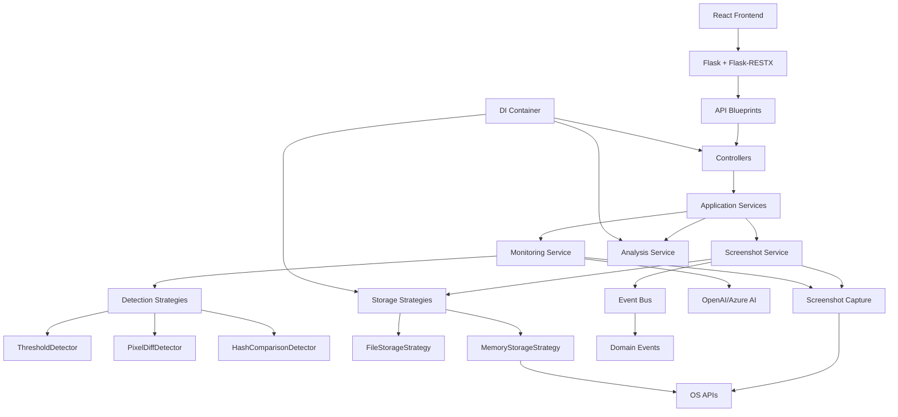

# ScreenAgent - System Design & Architecture

## Table of Contents
1. [System Overview](#system-overview)
2. [Core Features](#core-features)
3. [Architecture](#architecture)
4. [Module Design](#module-design)
5. [Data Flow](#data-flow)
6. [Platform Support](#platform-support)
7. [AI Integration](#ai-integration)
   - [Prompt Management System](#prompt-management-system)
8. [Web Interface](#web-interface)
9. [Configuration System](#configuration-system)
10. [Error Handling & Reliability](#error-handling--reliability)
11. [Security Considerations](#security-considerations)
12. [Performance Optimizations](#performance-optimizations)
13. [Future Enhancements](#future-enhancements)

## System Overview

ScreenAgent is a modern, intelligent screen monitoring application designed to capture and analyze changes within user-defined regions of interest (ROI). The system combines real-time monitoring, AI-powered analysis, and a responsive web interface to provide comprehensive screen activity tracking.

### Core Philosophy
- **Modular Architecture**: Clean separation of concerns with well-defined interfaces
- **Cross-Platform Compatibility**: Seamless operation across Linux, Windows, and WSL
- **Intelligence First**: AI-powered analysis for meaningful insights
- **User Experience**: Modern, responsive web interface with real-time updates
- **Reliability**: Robust error handling and graceful degradation

## Core Features

### 1. Region of Interest (ROI) Monitoring
- **Interactive Selection**: Web-based canvas for precise region selection
- **Real-time Detection**: Configurable change detection with sensitivity controls
- **Visual Feedback**: Overlay indicators and coordinate display
- **Minimum Size Validation**: Ensures meaningful monitoring areas

### 2. Intelligent Screenshot Capture
- **Automatic Triggers**: Change-based capture with configurable thresholds
- **Manual Controls**: On-demand capture via web interface or keyboard shortcuts
- **Platform Optimization**: Native capture methods for each operating system
- **Format Support**: Multiple image formats with compression options

### 3. AI-Powered Analysis
- **Multi-Provider Support**: OpenAI GPT-4 Vision, Azure AI, extensible to other models
- **Custom Prompts**: Configurable analysis prompts for specific use cases
- **Content Recognition**: Text extraction, UI element identification, anomaly detection
- **Contextual Analysis**: Understanding of changes and their significance

### 4. Modern Web Interface
- **Responsive Design**: Works just on desktop devices
- **Real-time Updates**: Live status indicators and automatic refresh
- **Gallery View**: Organized screenshot management with thumbnails
- **Settings Panel**: Dynamic configuration without application restart

### 5. Cross-Platform Support
- **Linux**: Native X11/Wayland support with optional MSS acceleration
- **Windows**: Direct Windows API integration
- **WSL**: PowerShell bridge for Windows display access
- **Keyboard Shortcuts**: Platform-aware keyboard handling

### 6. Configuration Management
- **Multi-Source**: Environment variables, JSON files, web interface
- **Dynamic Updates**: Runtime configuration changes
- **Validation**: Type checking and constraint validation
- **Persistence**: Automatic saving of user preferences

## Architecture

### High-Level Architecture

```
┌─────────────────────────────────────────────────────────────┐
│                    Web Interface Layer                      │
├─────────────────────────────────────────────────────────────┤
│  React Frontend (TS)  │  Flask Server  │  Flask-RESTX API  │
├─────────────────────────────────────────────────────────────┤
│                   Application Layer                        │
├─────────────────────────────────────────────────────────────┤
│   Screenshot Service   │   Monitoring Service   │   Analysis Service   │
├─────────────────────────────────────────────────────────────┤
│                   Infrastructure Layer                     │
├─────────────────────────────────────────────────────────────┤
│  Storage Strategies  │  Detection Strategies  │  DI Container  │
├─────────────────────────────────────────────────────────────┤
│                     Core Layer                             │
├─────────────────────────────────────────────────────────────┤
│ Config Manager │ Screenshot Capture │ Platform Detection   │
├─────────────────────────────────────────────────────────────┤
│                  Integration Layer                         │
├─────────────────────────────────────────────────────────────┤
│    AI Services    │  File System   │  Operating System    │
└─────────────────────────────────────────────────────────────┘
```

### Component Relationships



## Refactored Architecture Patterns

ScreenAgent has been refactored following clean architecture principles with several key patterns:

#### **Strategy Pattern for Change Detection**
```python
# Multiple detection algorithms with runtime switching
context = ChangeDetectionContext()
context.set_strategy(ThresholdDetector())      # Fast, basic detection
context.set_strategy(PixelDiffDetector())     # Accurate, intensive detection  
context.set_strategy(HashComparisonDetector()) # Exact, binary detection
```

#### **Dependency Injection Container**
```python
# Service registration and resolution
container = DIContainer()
container.register_singleton(IScreenshotService, ScreenshotService)
container.register_singleton(IMonitoringService, MonitoringService)

# Automatic dependency resolution
service = container.get(IScreenshotService)
```

#### **Event-Driven Architecture**
```python
# Domain events for monitoring lifecycle
event_bus.publish(ChangeDetectionStartedEvent(strategy_name="threshold"))
event_bus.publish(ChangeDetectionEvent(change_score=45.0))
event_bus.publish(ChangeDetectionStoppedEvent(reason="manual"))
```

#### **Storage Strategy Pattern**
```python
# Pluggable storage backends
storage_factory = StorageFactory()
file_storage = storage_factory.create_storage("file", base_path="screenshots")
memory_storage = storage_factory.create_storage("memory", max_screenshots=100)
```

#### **Clean Architecture Layers**
- **Domain**: Entities, value objects, interfaces, events
- **Application**: Business logic services, use cases
- **Infrastructure**: External concerns (file system, detection algorithms)
- **Interfaces**: Controllers, DTOs, API contracts

## Module Design

### 1. Core Modules (`src/core/`)

#### **Config Manager** (`config.py`)
- **Purpose**: Centralized configuration management
- **Responsibilities**:
  - Load/save configuration from multiple sources
  - Validate configuration values
  - Provide type-safe access to settings
  - Handle environment variable overrides

```python
class Config:
    - _load_config()
    - _save_config()
    - get(key, default)
    - set(key, value)
    - validate_roi(roi)
    - get_screenshot_dir()
```

#### **Screenshot Manager** (`screenshot_manager.py`)
- **Purpose**: Coordinate all screenshot-related functionality
- **Responsibilities**:
  - Manage screenshot collection and storage
  - Coordinate between ROI monitoring and capture
  - Handle keyboard shortcuts
  - Maintain screenshot metadata

```python
class ScreenshotManager:
    - initialize()
    - start_monitoring()
    - stop_monitoring()
    - take_manual_screenshot()
    - get_screenshots()
    - clear_all_screenshots()
```

#### **Screenshot Capture** (`screenshot_capture.py`)
- **Purpose**: Platform-specific screenshot capture
- **Responsibilities**:
  - Detect platform capabilities
  - Use optimal capture method for each platform
  - Handle ROI cropping
  - Manage capture errors gracefully

```python
class ScreenshotCapture:
    - initialize()
    - capture_full_screen()
    - capture_roi()
    - _capture_linux()
    - _capture_windows()
    - _capture_wsl()
```

#### **ROI Monitor** (`roi_monitor.py` + `refactored_roi_monitor.py`)
- **Purpose**: Monitor region of interest for changes using strategy pattern
- **Architecture**: Refactored in Phase 2.6 with strategy pattern and event-driven design
- **Responsibilities**:
  - Continuous monitoring loop with configurable detection strategies
  - Event-driven change detection with domain events
  - Thread-safe monitoring with proper lifecycle management
  - Strategy switching for different detection algorithms
  - Comprehensive statistics and history tracking

```python
class RefactoredROIMonitor:
    - start_monitoring(roi, strategy_name, threshold, check_interval)
    - stop_monitoring(reason)
    - change_strategy(strategy_name, reset_baseline)
    - force_screenshot()
    - add_change_callback()
    - get_status()
    - get_available_strategies()
    - update_settings()
```

**Change Detection Strategies** (`src/infrastructure/monitoring/`):
- **ThresholdDetector**: Fast size-based detection (default)
- **PixelDiffDetector**: Accurate pixel-by-pixel comparison  
- **HashComparisonDetector**: Exact change detection via hashing
- **ChangeDetectionContext**: Strategy management and switching
- **ChangeDetectionStrategyFactory**: Strategy creation and configuration

#### **Keyboard Handler** (`keyboard_handler.py`)
- **Purpose**: Global keyboard shortcut management
- **Responsibilities**:
  - Register global hotkeys
  - Handle permission requirements
  - Trigger screenshot actions
  - Platform-specific key handling

#### **Platform Detection** (`platform_detection.py`)
- **Purpose**: Detect and adapt to different operating systems
- **Responsibilities**:
  - WSL detection and configuration
  - Display server detection
  - Capability assessment
  - Method selection optimization

### 2. API Modules (`src/api/`)

#### **Flask API Server** (`flask_app.py`)
- **Purpose**: Modern web server and REST API with Flask framework
- **Responsibilities**:
  - REST API endpoints with Flask-RESTX
  - Swagger/OpenAPI documentation
  - Middleware for error handling, validation, security
  - Dependency injection integration
  - CORS configuration

```python
def create_app(config=None) -> Flask:
    # Flask app with Flask-RESTX API
    # Blueprints for different API modules
    # Middleware setup
    # Swagger documentation
```

**Key Improvements over Custom Server:**
- Professional web framework with proven reliability
- Automatic Swagger documentation generation
- Structured middleware pipeline
- Better error handling and validation
- Industry-standard security headers

#### **LLM Analyzer** (`llm_api.py`)
- **Purpose**: AI integration for screenshot analysis
- **Responsibilities**:
  - Multiple AI provider support
  - Image encoding and processing
  - Dynamic prompt management with real-time updates
  - Response parsing and formatting

```python
class LLMAnalyzer:
    - analyze_screenshot()
    - _setup_azure_client()
    - _setup_openai_client()
    - _encode_image()
```

#### **Prompts Blueprint** (`prompts.py`)
- **Purpose**: Dynamic prompt management API
- **Responsibilities**:
  - CRUD operations for analysis prompts
  - Configuration file persistence 
  - Validation and error handling
  - Swagger documentation integration

```python
class PromptsService:
    - get_prompts()
    - update_prompt()
    - get_prompt()
    - _ensure_config_exists()
```

### 3. Web Interface

#### **React Frontend** (`frontend/`)
- **Purpose**: Modern interactive web interface built with React.js
- **Responsibilities**:
  - Component-based UI architecture
  - Real-time status updates
  - ROI selection interface
  - Screenshot gallery management
  - Responsive design with Tailwind CSS

#### **Legacy Static Interface** (Removed)
- **Status**: ✅ **MIGRATED** - Obsolete static files and templates removed
- **Former Location**: `static/`, `templates/` (removed during Flask migration)
- **Replaced By**: React-based frontend with modern component architecture
- **Benefits**: Better maintainability, modern tooling, component reusability

## Storage System

### Storage Architecture

ScreenAgent implements a flexible storage system with multiple backends and automatic organization:

#### **File-Based Storage (Default)**
- **Location**: `~/repo/screenAgent/screenshots/` and `~/repo/screenAgent/temp/`
- **Organization**: Unique run directories prevent conflicts between app sessions
- **Structure**:
  ```
  screenshots/
  ├── run_20250621_102448_fd0d69c3/    # Unique per app run
  │   ├── d8a3f2bc-fab6-40d4-9b2d-7b3d63803dfd.png
  │   ├── af99385c-31f6-45d8-bbf7-1374a388b682.png
  │   └── metadata.json              # Screenshot index and metadata
  └── run_20250621_080855_de0319a6/    # Previous runs preserved
      └── ...
  
  temp/
  └── temp_screenshot.png             # ROI selection and preview
  ```

#### **Storage Features**
- **Unique Run Directories**: Format `run_YYYYMMDD_HHMMSS_<8-char-uuid>`
- **UUID File Names**: Screenshots saved with unique identifiers
- **Metadata Management**: Comprehensive JSON metadata with timestamps, ROI info, analysis results
- **Automatic Cleanup**: Configurable size limits with oldest-first removal
- **Thread Safety**: Proper locking mechanisms for concurrent access
- **Separation of Concerns**: Temp files separate from persistent storage

#### **Storage Backends**
```python
class ScreenshotStorage:
    - store_screenshot(screenshot: ScreenshotData) -> bool
    - retrieve_screenshot(screenshot_id: str) -> ScreenshotData
    - list_screenshots(limit: int) -> List[ScreenshotMetadata]
    - delete_screenshot(screenshot_id: str) -> bool
    - get_storage_stats() -> Dict[str, Any]
```

**Supported Backends**:
- **FileSystemScreenshotStorage**: Persistent file-based storage (default)
- **MemoryScreenshotStorage**: In-memory storage with optional persistence

#### **Configuration**
```json
{
  "storage_type": "filesystem",
  "screenshot_dir": "screenshots",
  "temp_screenshot_path": "temp/temp_screenshot.png",
  "max_screenshots": 100,
  "auto_cleanup": true
}
```

## Data Flow

### 1. Screenshot Capture Flow

```
User Action → Trigger → Screenshot Capture → Processing → Storage → Display
     ↓            ↓           ↓              ↓          ↓         ↓
Manual Click  ROI Change  Platform API   Format/Crop  Filesystem Web UI
Keyboard      Threshold   (PIL/MSS/PS)   Metadata     Run Dir   Gallery
Auto Timer    Detection   Error Handle   Validation   UUID.png  Analysis
                                        Temp Files   metadata.json
```

### 2. Storage Architecture Flow

```
Screenshot → Event → Orchestrator → Storage Manager → File System
     ↓         ↓         ↓              ↓               ↓
Capture    Metadata   Coordination   Backend Choice   /screenshots/
ROI Data   Timestamp  Error Handle   File/Memory      run_YYYYMMDD_HHMMSS_<uuid>/
Temp File  UUID       Event System   Thread Safety    <uuid>.png + metadata.json
```

### 3. Configuration Flow

```
Source → Validation → Merge → Cache → Access → Persistence
  ↓         ↓         ↓      ↓       ↓         ↓
File      Type       Env    Memory  Getter    Auto-save
WebUI     Range      Var    Dict    Method    JSON
EnvVar    Required   Over   Cache   Property  File
Storage   Path       Keys   Config  Dynamic   Run Dir
```

### 4. AI Analysis Flow

```
Screenshot → Encoding → API Call → Response → Parsing → Storage → Display
    ↓           ↓          ↓         ↓         ↓         ↓         ↓
Base64      Format     OpenAI    JSON      Extract   File      WebUI
Resize      Headers    Azure     Stream    Text      Metadata  Gallery
Optimize    Auth       Claude    Error     Insights  JSON      Response
Load File   Token      Models    Retry     Context   UUID      Response
```

## Platform Support

### Linux (Native)
- **Display Detection**: X11 (`$DISPLAY`) and Wayland (`$WAYLAND_DISPLAY`)
- **Capture Methods**: 
  - Primary: `PIL.ImageGrab`
  - Fallback: `pyautogui`
  - Performance: `mss` (if available)
- **Keyboard**: Requires elevated permissions for global hotkeys
- **Dependencies**: `xlib`, `pynput`, optional `mss`

### Windows
- **Capture Methods**:
  - Primary: `PIL.ImageGrab` (Windows API)
  - Fallback: `pyautogui`
- **Keyboard**: Native Windows API support
- **Dependencies**: Minimal, uses built-in Windows APIs

### WSL (Windows Subsystem for Linux)
- **Detection**: `/proc/version` contains "microsoft" or "wsl"
- **Capture Method**: PowerShell bridge to Windows
- **Command**: `powershell.exe -Command "Add-Type -AssemblyName System.Windows.Forms; [System.Windows.Forms.Screen]::PrimaryScreen"`
- **Limitations**: Keyboard shortcuts require Windows host configuration

### Universal Fallbacks
- **pyautogui**: Cross-platform fallback for all operations
- **PIL**: Image processing and format handling
- **Error Handling**: Graceful degradation when methods fail

## AI Integration

### Provider Architecture
```python
class LLMAnalyzer:
    providers = {
        'azure': AzureAIProvider,
        'openai': OpenAIProvider,
        'claude': ClaudeProvider,  # Future
        'gemini': GeminiProvider   # Future
    }
```

### Configuration
- **Environment Variables**: `AZURE_AI_ENDPOINT`, `OPENAI_API_KEY`
- **Model Selection**: `gpt-4o`, `gpt-4-vision-preview`, `claude-3-opus`
- **Custom Prompts**: User-configurable analysis prompts
- **Rate Limiting**: Built-in request throttling

### Analysis Features
- **Content Description**: General screenshot description
- **Change Detection**: Identify what changed between screenshots
- **Text Extraction**: OCR-like text recognition
- **UI Analysis**: Button, form, and interface element identification
- **Anomaly Detection**: Unusual patterns or errors

### Prompt Management System

ScreenAgent features a dynamic prompt management system that allows users to create, edit, and customize AI analysis prompts in real-time.

#### **Configuration Structure**
```json
{
  "prompts": {
    "general": {
      "id": "general",
      "name": "📝 General Description",
      "text": "Describe what you see in this screenshot in detail.",
      "description": "A general description of the screenshot content"
    },
    "ui_elements": {
      "id": "ui_elements", 
      "name": "🎯 UI Elements Analysis",
      "text": "Identify all UI elements, buttons, menus, and interface components visible in this screenshot.",
      "description": "Analyzes user interface elements and components"
    }
  }
}
```

#### **API Endpoints**
- `GET /api/prompts/` - Retrieve all available prompts
- `GET /api/prompts/{prompt_id}` - Get specific prompt by ID
- `PUT /api/prompts/{prompt_id}` - Update prompt text and metadata

#### **Frontend Integration**
- **Dynamic Loading**: Prompts loaded from API on modal open
- **Inline Editing**: PromptEditor component with save/cancel functionality
- **Real-time Updates**: Changes immediately available for analysis
- **Visual Feedback**: Indicates unsaved changes and loading states
- **Fallback Support**: Uses hardcoded prompts if API is unavailable

#### **Key Features**
- **Persistent Storage**: Prompts saved to `config/prompts/image_analysis.json`
- **Type Safety**: Full TypeScript interfaces for frontend integration
- **Error Handling**: Graceful degradation with fallback prompts
- **User Experience**: Compact editor with hover effects and auto-save
- **Extensibility**: Easy to add new prompt categories and templates

## Web Interface

### Technology Stack
- **Frontend**: React.js with TypeScript and Vite build system
- **Styling**: Tailwind CSS with responsive design
- **Backend**: Flask + Flask-RESTX with Swagger documentation
- **API**: RESTful API with automatic OpenAPI documentation
- **Architecture**: Clean architecture with dependency injection
- **Testing**: pytest with Flask test client integration

### Flask API Architecture
- **Blueprints**: Modular route organization (screenshots, monitoring, configuration, analysis, prompts)
- **Middleware**: Error handling, validation, security headers, logging
- **Models**: Swagger models for automatic API documentation
- **DI Integration**: Direct container access replacing Flask-Injector
- **CORS**: Configured for frontend development and production

### Interface Components

#### Dashboard Tab
- **Status Indicators**: Monitoring state, capture count, uptime
- **Quick Actions**: Start/stop monitoring, manual capture
- **Statistics**: Real-time metrics and performance data

#### Screenshots Tab
- **Gallery View**: Grid layout with thumbnails
- **Metadata Display**: Timestamp, file size, analysis status
- **Actions**: View full size, download, analyze, delete
- **Bulk Operations**: Select multiple, delete all

#### Monitor Tab
- **ROI Selection**: Interactive canvas with visual feedback
- **Preview**: Current ROI with overlay
- **Configuration**: Sensitivity, interval, threshold settings

#### Settings Tab
- **AI Configuration**: Provider selection, API keys, editable prompts
- **Prompt Management**: Inline editing of analysis prompts with auto-save
- **Monitoring Options**: Auto-start, keyboard shortcuts
- **Display Preferences**: Theme, gallery size, refresh rate

### Real-time Features
- **Auto-refresh**: Periodic updates without page reload
- **Status Updates**: Live monitoring indicators
- **Progress Feedback**: Loading states and operation progress
- **Error Notifications**: User-friendly error messages

## Configuration System

### Configuration Sources (Priority Order)
1. **Runtime Changes**: Web interface modifications
2. **Environment Variables**: `OPENAI_API_KEY`, `AZURE_AI_ENDPOINT`, etc.
3. **Config File**: `screen_agent_config.json`
4. **Prompt Configuration**: `config/prompts/image_analysis.json` 
5. **Defaults**: Built-in fallback values

### Configuration Schema
```json
{
  "roi": [100, 100, 800, 800],
  "change_threshold": 20,
  "check_interval": 0.5,
  "port": 8000,
  "max_screenshots": 100,
  "llm_enabled": false,
  "llm_model": "gpt-4o",
  "llm_prompt": "Describe what you see in this screenshot...",
  "keyboard_shortcuts": {
    "screenshot": "ctrl+shift+s"
  },
  "auto_start_monitoring": false,
  "save_screenshots": true,
  "screenshot_format": "png",
  "storage_type": "filesystem",
  "screenshot_dir": "screenshots",
  "temp_screenshot_path": "temp/temp_screenshot.png",
  "auto_cleanup": true
}
```

### Validation Rules
- **ROI**: Must be valid coordinates within screen bounds
- **Thresholds**: Numeric ranges with min/max limits
- **Intervals**: Positive numbers with reasonable bounds
- **Paths**: Valid file system paths with write permissions
- **API Keys**: Format validation for different providers

## Error Handling & Reliability

### Error Categories

#### **Recoverable Errors**
- Network timeouts for AI analysis
- Temporary file system issues
- Screenshot capture failures
- Configuration validation errors

#### **Non-Recoverable Errors**
- Missing dependencies
- Permission denied errors
- Invalid configuration files
- System capability limitations

### Error Handling Strategies

#### **Graceful Degradation**
```python
try:
    screenshot = capture_with_mss()
except ImportError:
    screenshot = capture_with_pil()
except Exception:
    screenshot = capture_with_pyautogui()
```

#### **User Feedback**
- **Web Interface**: Toast notifications and error panels
- **Console**: Structured logging with severity levels
- **Status Indicators**: Visual feedback for system state

#### **Automatic Recovery**
- **Retry Logic**: Exponential backoff for transient failures
- **Fallback Methods**: Multiple approaches for each operation
- **State Restoration**: Resume monitoring after errors

### Logging System
```python
import logging

logger = logging.getLogger('screenagent')
handler = logging.FileHandler('screenagent.log')
formatter = logging.Formatter('%(asctime)s - %(name)s - %(levelname)s - %(message)s')
```

## Security Considerations

### Data Protection
- **Local Storage**: Screenshots stored locally, not transmitted
- **API Keys**: Environment variable storage, not in config files
- **Temporary Files**: Automatic cleanup of temporary data

### Access Control
- **Local Only**: Web interface bound to localhost by default
- **Port Configuration**: User-configurable port selection
- **File Permissions**: Appropriate file system permissions

### Privacy Features
- **No Telemetry**: No data sent to external services except chosen AI providers
- **User Control**: Complete control over what data is analyzed
- **Data Retention**: Configurable screenshot retention limits

## Performance Optimizations

### Screenshot Capture
- **Platform Optimization**: Use fastest available method for each OS
- **ROI Cropping**: Capture only required regions
- **Format Selection**: Efficient image formats and compression
- **Caching**: Avoid redundant captures

### Memory Management
- **Circular Buffer**: Limit screenshot collection size
- **Image Compression**: Balance quality vs. memory usage
- **Garbage Collection**: Explicit cleanup of large objects
- **Background Processing**: Non-blocking operations

### Network Efficiency
- **Image Optimization**: Resize images before AI analysis
- **Request Batching**: Group API calls when possible
- **Caching**: Cache analysis results
- **Compression**: Compress data transmission

### User Interface
- **Lazy Loading**: Load images as needed
- **Virtual Scrolling**: Handle large screenshot collections
- **Debounced Updates**: Reduce unnecessary re-renders
- **Background Sync**: Non-blocking data updates

## Multi-Monitor Support & Troubleshooting

### Multi-Monitor Architecture

ScreenAgent handles multi-monitor setups through virtual screen coordinate mapping:

#### **Coordinate System**
```
┌─────────────────────────────────────────────────────┐
│                Virtual Screen                        │
│  ┌─────────────┐              ┌─────────────┐      │
│  │   Monitor 1 │              │   Monitor 2 │      │
│  │ (Secondary) │              │  (Primary)  │      │
│  │             │              │             │      │
│  │   (0,0)     │              │ (1920,0)    │      │
│  │             │              │             │      │
│  └─────────────┘              └─────────────┘      │
└─────────────────────────────────────────────────────┘
```

#### **WSL Multi-Monitor Implementation**
The WSL PowerShell bridge handles multi-monitor through:

1. **Virtual Screen Detection**:
   ```powershell
   $VScreen = [System.Windows.Forms]::VirtualScreen
   # Gets the bounding box of all monitors combined
   ```

2. **Individual Monitor Analysis**:
   ```powershell
   $Monitors = [System.Windows.Forms.Screen]::AllScreens
   # Enumerates each physical monitor with bounds
   ```

3. **Coordinate Validation**:
   - ROI coordinates from web interface are virtual screen coordinates
   - Validates ROI fits within virtual screen bounds
   - Detects which monitor(s) the ROI intersects

#### **Common Multi-Monitor Issues**

**Problem: ROI captured from wrong monitor**
- **Cause**: Coordinate system misalignment between web interface and capture
- **Solution**: Enhanced coordinate validation and monitor intersection detection
- **Debug**: PowerShell outputs detailed monitor bounds and ROI validation

**Problem: ROI capture returns minimal data**
- **Cause**: ROI coordinates may be outside virtual screen bounds
- **Solution**: Bounds checking and error reporting
- **Debug**: File size validation against expected ROI dimensions

**Problem: Inconsistent results across monitors**
- **Cause**: Different pixel densities or scaling factors
- **Solution**: Use absolute virtual screen coordinates
- **Debug**: Monitor-specific bounds logging

#### **Debugging Multi-Monitor Issues**

**Enhanced Debug Output**:
```bash
# Run with debug output
python debug_multimonitor.py

# Check PowerShell output for:
# - Virtual screen bounds
# - Individual monitor positions  
# - ROI intersection analysis
# - Coordinate validation results
```

**Validation Steps**:
1. **Check Virtual Screen**: Verify ROI coordinates fit within virtual bounds
2. **Monitor Intersection**: Ensure ROI intersects at least one monitor
3. **File Size Validation**: Compare output size to expected ROI dimensions
4. **Visual Verification**: Compare captured ROI to expected screen area

#### **Multi-Monitor Best Practices**

**For Users**:
- Use the web interface for ROI selection (handles coordinates automatically)
- Verify ROI selection on the correct monitor in preview
- Check that green ROI outline matches intended area

**For Developers**:
- Always validate ROI coordinates against virtual screen bounds
- Log monitor intersection information for debugging
- Implement file size sanity checks for capture validation
- Use virtual screen coordinates consistently throughout the system

**Configuration Tips**:
- Monitor arrangement affects virtual screen coordinate system
- Primary monitor position influences coordinate origins
- Display scaling may affect coordinate precision

### Future Multi-Monitor Enhancements

- **Per-Monitor ROI**: Support multiple ROIs across different monitors
- **Monitor-Specific Settings**: Individual configuration per monitor
- **Display Change Detection**: Automatic recalibration when monitors are added/removed
- **DPI Awareness**: Handle different DPI scaling factors properly

---

*This design document serves as the single source of truth for understanding ScreenAgent's architecture, features, and implementation details. It should be updated as the system evolves and new features are added.*
